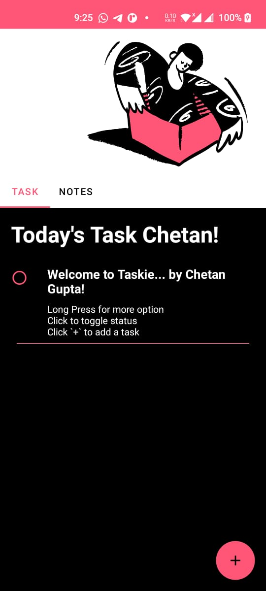

# Taskie - A Note Taking MVVM Application! 
### Designed a simple Notes Android app following features
- A simple Notes Android app following features
- Single activity architecture
- Social login: Google Sign-in 
- Shared preferences
- Jetpack Room Database
- Fragment + Recycler View + ViewPager2 + Collapsable Layout 
    - List of Todos
    - List of Notes
- Floating action button + bottom sheets 
    - adding Todos | Notes
- features Create | Update | Delete Todos and Notes

## Preview
<table style="width:100%">
<tr>
 <th></th>
 <th></th>
 <th></th>
</tr>
</table>

*Download preview apk from* [here](taskie.apk)

